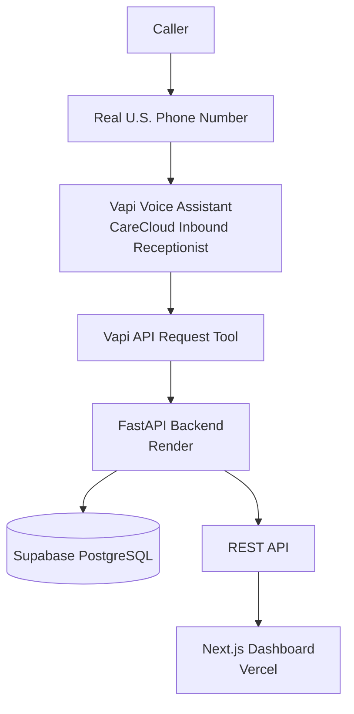

# CareCloud Voice AI Patient Registration

A voice-based AI patient registration system built for the CareCloud AI Engineer take-home
technical assessment. A caller dials a real U.S. phone number, a Vapi voice assistant
conducts a natural conversation to collect patient demographics, the data is validated and
persisted to Supabase PostgreSQL through a FastAPI REST API, and a Next.js dashboard displays
the registered patients.

## Overview

```
Caller
  ↓
Real U.S. Phone Number
  ↓
Vapi Voice AI
  ↓
CareCloud Inbound Receptionist (Vapi Assistant)
  ↓
Vapi API Request Tool
  ↓
FastAPI Backend
  ↓
Supabase PostgreSQL
  ↓
REST API
  ↓
Next.js Dashboard
```

The assistant collects required demographics, accepts optional information if the caller
chooses to provide it, reads everything back for confirmation, and only saves the record
after the caller explicitly confirms.

## Live Demo

| Component | Link |
|---|---|
| Real phone number | +1 (945) 667-5332 |
| Vapi assistant | CareCloud Inbound Receptionist |
| Backend / API | [voice-ai-patient-registration-ua8y.onrender.com](https://voice-ai-patient-registration-ua8y.onrender.com) |
| Dashboard | [voice-ai-patient-registration-ten.vercel.app](https://voice-ai-patient-registration-ten.vercel.app/) |
| GitHub repository | [github.com/Uzairkahn/voice-ai-patient-registration](https://github.com/Uzairkahn/voice-ai-patient-registration) |

**This system was tested end-to-end with a real phone call.** A U.S.-based caller dialed
+1 (945) 667-5332, the Vapi assistant conducted the registration conversation, the caller
confirmed the collected information, the `create_patient` tool called the live FastAPI
backend on Render, the record was persisted in Supabase, and it appeared correctly in the
live Vercel dashboard. After this test, the dashboard showed 4 registered patient records.

> Note: > Note: The live phone number was successfully tested by a U.S.-based relative, who completed the patient registration flow through the Vapi assistant.

## Architecture



## Features

- Real, dialable U.S. phone number answered by a conversational Vapi voice assistant
- LLM-powered (OpenAI, via Vapi) natural-language understanding — varied phrasing,
  out-of-order answers, and corrections
- Full read-back and explicit confirmation before any data is saved
- Server-side validated FastAPI REST API for patient CRUD operations
- Persistent Supabase PostgreSQL storage, surviving server restarts
- Soft delete (no data is ever hard-deleted)
- Duplicate-caller detection by phone number
- Next.js dashboard for browsing and searching registered patients
- Structured logging of collected patient data for observability
- Automated backend test suite

## Voice Agent

**Provider:** Vapi
**Assistant:** CareCloud Inbound Receptionist
**LLM:** OpenAI (via Vapi)

The assistant is intentionally conversational rather than a rigid IVR menu. It:

- Understands natural language and varied phrasing
- Accepts information in any order and remembers what's already been given
- Allows corrections ("Actually, my last name is spelled...")
- Asks clarifying questions instead of guessing or inventing missing information
- Validates important fields and re-prompts specifically when something is invalid
- Reads back all collected information and requires explicit confirmation
- Only calls the patient-creation tool after the caller confirms
- Only tells the caller registration succeeded after a successful backend response
- Handles API/database errors gracefully instead of failing silently
- Ends the call gracefully after successful registration

The Vapi API Request tool calls:

```
POST https://voice-ai-patient-registration-ua8y.onrender.com/patients
```

A dedicated end-call tool is configured for graceful call completion.

## Patient Data Model

**Required fields:** `first_name`, `last_name`, `date_of_birth`, `sex`, `phone_number`,
`address_line_1`, `city`, `state`, `zip_code`

**Optional fields:** `email`, `address_line_2`, `insurance_provider`,
`insurance_member_id`, `preferred_language`, `emergency_contact_name`,
`emergency_contact_phone`

**Auto-generated:** `patient_id`, `created_at`, `updated_at`, `deleted_at`

## REST API

**Backend:** Python + FastAPI

| Method | Endpoint | Description |
|---|---|---|
| GET | `/health` | Liveness check |
| GET | `/patients` | List patients; optional `last_name`, `date_of_birth`, and `phone_number` filters |
| GET | `/patients/{id}` | Retrieve a single patient |
| POST | `/patients` | Create a patient |
| PUT | `/patients/{id}` | Partially update a patient |
| DELETE | `/patients/{id}` | Soft delete a patient |

All responses use a consistent envelope:

```json
{ "data": { ... }, "error": null }
```

or

```json
{ "data": null, "error": { "message": "..." } }
```

`POST /patients` returns a conflict response instead of creating a duplicate record if
an active patient already exists with the same phone number (see [Bonus
Features](#bonus-features)). `PUT /patients/{id}` explicitly refreshes `updated_at` on
every update. `DELETE /patients/{id}` performs a soft delete — it sets `deleted_at` and
never removes the row.

Server-side validation is enforced independently of the voice agent — the API does not
rely solely on the assistant to catch bad input.

## Validation

Validation is implemented with Pydantic v2 `@field_validator`s:

- **Names** (`first_name`, `last_name`): 1–50 characters, letters plus hyphens and
  apostrophes only
- **Date of birth**: must be a valid date and cannot be in the future
- **Sex**: `Male`, `Female`, `Other`, or `Decline to Answer`
- **Phone numbers** (`phone_number`, `emergency_contact_phone`): exactly 10 digits
- **Email**: validated email format when provided
- **State**: checked against the actual list of U.S. state abbreviations (including DC),
  not just "any two letters"
- **ZIP code**: 5-digit or ZIP+4 format
- **Insurance member ID**: alphanumeric when provided

**Blank-optional-field handling:** Vapi can send optional fields as empty strings rather
than omitting them. The backend normalizes blank optional strings (`email`,
`address_line_2`, `insurance_provider`, `insurance_member_id`, `preferred_language`,
`emergency_contact_name`, `emergency_contact_phone`) to `None` before validation, so a
caller can decline optional information without triggering a validation error.

## Database

**Database:** Supabase PostgreSQL
**Schema:** [`database/schema.sql`](./database/schema.sql)

Data is persistent and survives backend restarts. The `patients` table stores
`patient_id`, all demographic fields, `created_at`, `updated_at`, and `deleted_at`.
Deletion is implemented as a **soft delete** via `deleted_at` — there is no hard delete.

## Dashboard

**Stack:** Next.js, TypeScript, Tailwind CSS
**Location:** [`dashboard/`](./dashboard/)

The dashboard was built after the backend was complete and communicates with the FastAPI
backend exclusively through the `NEXT_PUBLIC_API_URL` environment variable. It does not
contain any Supabase credentials.

Features:

- CareCloud branding
- Total registered patient count
- Search by last name, phone number, and date of birth
- Manual refresh
- Registered patient table with a details view/modal
- Loading, empty, and API error states
- Responsive layout

## Testing

Automated backend tests live under [`tests/`](./tests/):

- `tests/test_patient_schema.py` — validation rules (names, dates, sex, phone, state,
  ZIP, insurance member ID)
- `tests/test_patient_service.py` — service-layer duplicate-phone / lookup behavior,
  using a mocked Supabase client

Run locally with:

```bash
pytest
```

The API was also manually verified via FastAPI's Swagger UI (`/docs`), covering the
health endpoint, patient creation, listing, retrieval, update, soft deletion, invalid
state rejection, and duplicate-phone detection. Beyond the API layer, the full live
pipeline was verified with a real phone call: Vapi → FastAPI (Render) → Supabase →
dashboard (Vercel).

## Local Development

### Backend Setup

```bash
# from the repository root
python -m venv venv
source venv/bin/activate   # Windows: venv\Scripts\activate
pip install -r requirements.txt
cp .env.example .env       # fill in SUPABASE_URL and SUPABASE_KEY
uvicorn app.main:app --reload
```

Visit `http://127.0.0.1:8000/docs` for interactive API docs.

### Frontend Setup

```bash
cd dashboard
npm install
cp .env.example .env.local   # set NEXT_PUBLIC_API_URL
npm run dev
```

## Environment Variables

**Backend**

```
SUPABASE_URL=your_supabase_project_url
SUPABASE_KEY=your_server_side_supabase_key
```

**Frontend**

```
NEXT_PUBLIC_API_URL=https://your-backend-url
```

Server-side Supabase credentials must never be exposed in the browser or committed to
Git — the frontend only ever talks to the backend's public URL, never to Supabase
directly.

## Deployment

### Supabase
Hosts the PostgreSQL database. Schema is defined in `database/schema.sql`.

### Render
Hosts the FastAPI backend. Render deploys the **repository root** (the backend is
intentionally kept at the root, not nested under a `backend/` folder). The start command
runs the FastAPI app and binds to Render's `$PORT`. The Python runtime is pinned via
`.python-version` (3.13).

Live URL: [voice-ai-patient-registration-ua8y.onrender.com](https://voice-ai-patient-registration-ua8y.onrender.com)

### Vapi
Hosts the voice assistant ("CareCloud Inbound Receptionist") and the real phone number,
+1 (945) 667-5332. The assistant's API Request tool calls the Render-hosted
`POST /patients` endpoint, and an end-call tool handles graceful call completion.

### Vercel
Hosts the Next.js dashboard, with `dashboard/` set as the project's Root Directory.

Live URL: [voice-ai-patient-registration-ten.vercel.app](https://voice-ai-patient-registration-ten.vercel.app/)

## Security

- All secrets are provided via environment variables — nothing is hardcoded
- Supabase service-role/secret credentials remain server-side only
- The frontend only ever uses the public `NEXT_PUBLIC_API_URL` — it never holds
  Supabase credentials
- This is a technical assessment; no real patient data should be used, and this
  system does not claim HIPAA compliance

## Observability

The backend logs the final collected patient payload to stdout on create and update,
satisfying the assessment's logging requirement for tracing what data was received and
persisted.

## Assessment Coverage

| Requirement | Status |
|---|---|
| Real, dialable U.S. phone number | ✅ +1 (945) 667-5332 |
| Natural, conversational voice agent | ✅ |
| LLM-powered interaction | ✅ OpenAI via Vapi |
| Patient demographic collection | ✅ |
| Server-side validation | ✅ |
| Correction handling | ✅ |
| Confirmation before saving | ✅ |
| Persistent database | ✅ Supabase PostgreSQL |
| REST API | ✅ |
| Voice agent → backend/database integration | ✅ Verified via live call |
| Success/error handling | ✅ |
| Soft delete | ✅ `deleted_at` |
| Live deployment | ✅ Render + Vercel |
| Observability/logging | ✅ |
| Documentation | ✅ |

## Bonus Features

These are additional capabilities beyond the assessment's core requirements:

- **Duplicate phone detection during patient creation** — `POST /patients` checks
  whether an active patient already exists with the same phone number and returns a
  conflict response instead of creating a duplicate record. A dedicated conversational
  update flow (letting the caller update the existing record by voice) was not
  implemented — this is a limitation of this bonus feature, not a missing core
  requirement.
- **Dashboard** — Next.js/TypeScript/Tailwind frontend for browsing patients
- **Automated tests** — backend test suite under [`tests/`](./tests/)

Appointment scheduling, Spanish/multilingual support, and call transcript storage were
not implemented.

## Known Limitations / Trade-offs

- This is a technical assessment, not a production, HIPAA-compliant healthcare system.
  No real patient data should be used with it.
- The current Vapi phone number is on a free tier and is inbound-only.
- Duplicate-phone detection (a bonus feature) is implemented at patient creation, but
  the current Vapi tool setup does not include a dedicated conversational update flow,
  so the assistant cannot yet act on a detected duplicate over the phone.
- The dashboard does not implement a production-grade authentication/authorization
  layer.
- The developer could not personally place a test call from Pakistan due to lack of
  international calling balance; the live number was verified by a U.S.-based caller
  instead.

## Next Steps

- Add a conversational update flow so the assistant can act on duplicate-phone
  detection during a call
- Add authentication/authorization to the dashboard
- Expand automated test coverage to the API/route layer (current tests cover schema
  validation and service-layer logic)

## Tech Stack

| Layer | Technology |
|---|---|
| Voice / Telephony | Vapi |
| LLM | OpenAI (via Vapi) |
| Backend | Python, FastAPI |
| Validation | Pydantic v2 |
| Database | Supabase (PostgreSQL) |
| Dashboard | Next.js, TypeScript, Tailwind CSS |
| Backend hosting | Render |
| Frontend hosting | Vercel |
| Python runtime | 3.13 (pinned via `.python-version`) |

## Project Structure

```
voice-ai-patient-registration/
├── app/                    # FastAPI backend
├── tests/                  # Backend tests
├── database/               # Database schema (schema.sql)
├── dashboard/               # Next.js frontend/dashboard
├── requirements.txt
├── .python-version
├── Procfile
├── .env.example
├── .gitignore
└── README.md
```
